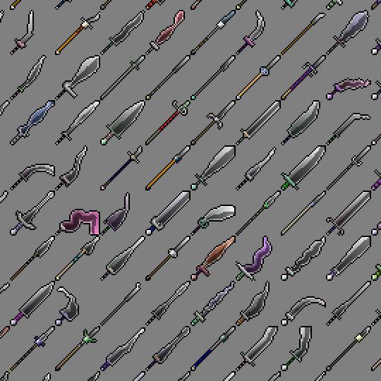

# icon-machine
Web application for randomly generating pixel art icons. You can try it out [on this page][1].

Generated icons are [CC0][2]-licensed. The Javascript source code is GPL-licensed.

[1]: https://www.brianmacintosh.com/iconmachine
[2]: https://creativecommons.org/publicdomain/zero/1.0/
